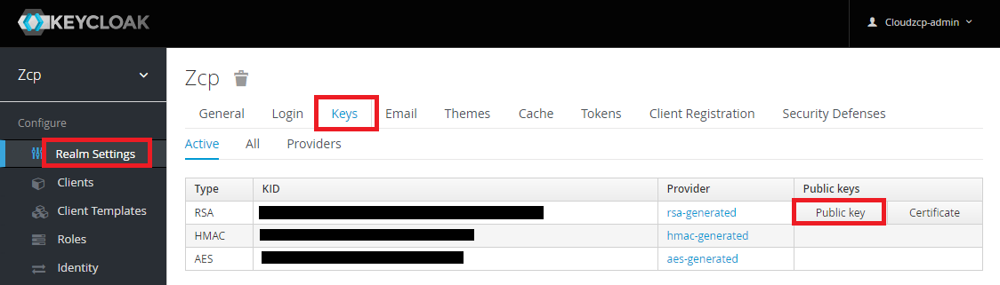
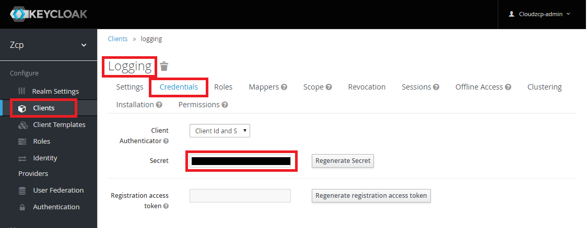

# zcp-logging

## Logging Component 

| Component        | Version           | Image  | etc |
| ------------- |-------------|-----|----|
|Elasticsearch| 6.3.1 |docker.elastic.co/elasticsearch/elasticsearch:6.3.1
|Kibana|  6.3.1 |docker.elastic.co/kibana/kibana:6.3.1
|Elasticsearch-curator|  5.5.4  |quay.io/pires/docker-elasticsearch-curator:5.5.4
|Fluent-bit| 0.13.4 |fluent/fluent-bit:0.13.4
|FluentD| 1.2.5 |fluent/fluentd:v1.2.5-debian | Add plugins
|Keycloak proxy| 3.4.2  |jboss/keycloak-proxy:3.4.2.Final

## 사전 준비
* ### Helm client 설치 
  설치는 각자 알아서 할 것
  ```
  $ helm init --client-only

  # Repository 추가
  $ helm repo add zcp https://raw.githubusercontent.com/cnpst/charts/master/docs
  ```

* ### Clone this project into desktop
  ```
  $ git clone https://github.com/cnpst/zcp-logging.git
  ```
  설치 파일 디렉토리로 이동한다.
  ```
  $ cd zcp-logging
  ```

* ### Logging 노드가 1대인 경우 아래 내용 미리 수행
  * es-data StatefulSet Replicas 수정
    ```
    $ vi elasticsearch/es-data-statefulset.yaml

    apiVersion: apps/v1beta1
    kind: StatefulSet
    metadata:
      labels:
        app: elasticsearch
        component: elasticsearch
        role: data
      name: elasticsearch-data
      namespace: zcp-system
    spec:
      updateStrategy:
        type: RollingUpdate
      podManagementPolicy: Parallel
      serviceName: elasticsearch-data
      replicas: 1 # replicas 값을 3에서 1로 수정
      template:
        metadata:
    ...
    ```

  * es-client deploy 의 affinity, toleration 을 management로 변경
    > 노드 1개인 경우 리소스 문제로 client 를 management 에 설치
    ```
    $ vi elasticsearch/es-client-deploy.yaml

    ...
    spec:
      tolerations:
      - key: "management" # logging 을 management 로 수정
        operator: "Equal"
        value: "true"
        effect: "NoSchedule"
      restartPolicy: Always
      affinity:
        nodeAffinity:
          requiredDuringSchedulingIgnoredDuringExecution:
            nodeSelectorTerms:
            - matchExpressions:
              - key: beta.kubernetes.io/arch
                operator: In
                values:
                - "amd64"
              - key: role 
                operator: In
                values:
                - "management" # logging 을 management 로 수정
    ...
    ```
  * SSO Logging 의 affinity, toleration 을 management로 변경
    > 노드 1개인 경우 SSO Logging 을 management 에 설치
    ```
    $ vi keycloak/values.yaml
    # AKS 인 경우 
    $ vi keycloak/values-aks.yaml

    ...
    affinity: 
      nodeAffinity:
        requiredDuringSchedulingIgnoredDuringExecution:
          nodeSelectorTerms:
          - matchExpressions:
            - key: beta.kubernetes.io/arch
              operator: In
              values:
              - amd64
            - key: role
              operator: In
              values:
              - management    # logging 을 management 로 수정

    tolerations:
      - key: "management"     # logging 을 management 로 수정
        operator: "Equal"
        value: "true"
        effect: "NoSchedule"
    ...
    ```
  * Fluentd config map 수정
    > Data 노드가 1개 이므로 Index template 의 shard 를 1 replica 를 0 으로 수정
    ```
    vi fluentd/fluentd-configmap.yaml

    ...
    application-log.json: |
      {
        "template" : "*",
        "version" : 1,
        "order" : 10000,
        "settings" : {
          "index.refresh_interval" : "5s",
          "number_of_shards": 1,    # 5 에서 1 로 수정
          "number_of_replicas": 0   # 1 에서 0 으로 수정
        },
    ...
    ```

## Install PVC for elasticsearch

  * Data node가 1개인 경우

    * PVC 생성
  
      ```sh
      $ kubectl create -f pvc-data-1.yaml
      # AKS 인 경우
      $ kubectl create -f aks/pvc-data-1-aks.yaml
      persistentvolumeclaim "elasticsearch-data-elasticsearch-data-0" created
      ```

    * 생성한 PVC의 상태가 Bound로 되었는지 확인

      ```sh
      $ kubectl get pvc -n zcp-system
      NAME                                      STATUS    VOLUME                                     CAPACITY   ACCESS MODES   STORAGECLASS               AGE
      elasticsearch-data-elasticsearch-data-0   Bound     pvc-e6f4738b-a771-11e8-84b7-aa133192a9ef   200Gi      RWO            ibmc-block-retain-silver   8m
      ```

  * Data node가 3개인 경우

    * PVC 생성

      ```sh
      $ kubectl create -f pvc-data-3.yaml
      # AKS 인 경우
      $ kubectl create -f aks/pvc-data-3-aks.yaml
      persistentvolumeclaim "elasticsearch-data-elasticsearch-data-0" created
      persistentvolumeclaim "elasticsearch-data-elasticsearch-data-1" created
      persistentvolumeclaim "elasticsearch-data-elasticsearch-data-2" created
      ```

    * 생성한 PVC의 상태가 Bound로 되었는지 확인

      ```sh
      $ kubectl get pvc -n zcp-system
      NAME                                      STATUS    VOLUME                                     CAPACITY   ACCESS MODES   STORAGECLASS               AGE
      elasticsearch-data-elasticsearch-data-0   Bound     pvc-e6f4738b-a771-11e8-84b7-aa133192a9ef   200Gi      RWO            ibmc-block-retain-silver   8m
      elasticsearch-data-elasticsearch-data-1   Bound     pvc-13939589-a772-11e8-84b7-aa133192a9ef   200Gi      RWO            ibmc-block-retain-silver   7m
      elasticsearch-data-elasticsearch-data-2   Bound     pvc-1961fb18-a772-11e8-84b7-aa133192a9ef   200Gi      RWO            ibmc-block-retain-silver   6m
      ```

## Install logging system

  * elasticsearch 설치

    ```sh
    $ kubectl create -f elasticsearch
    deployment.extensions "elasticsearch-client" created
    configmap "es-configmap" created
    service "elasticsearch-data" created
    statefulset.apps "elasticsearch-data" created
    service "elasticsearch-discovery" created
    deployment.extensions "elasticsearch-master" created
    service "elasticsearch" created
    ```

  * elasticsearch-curator 설치 (오래된 Index 삭제)
    ```sh
    $ helm install stable/elasticsearch-curator --version 1.5.0 -n es-curator -f elasticsearch-curator/values.yaml --namespace=zcp-system

    NAME:   es-curator
    LAST DEPLOYED: Mon May 13 18:11:03 2019
    NAMESPACE: zcp-system
    STATUS: DEPLOYED

    RESOURCES:
    ==> v1beta1/CronJob
    NAME                              SCHEDULE    SUSPEND  ACTIVE  LAST SCHEDULE  AGE
    es-curator-elasticsearch-curator  0 15 * * *  False    0       <none>         0s

    ==> v1/ConfigMap
    NAME                                     DATA  AGE
    es-curator-elasticsearch-curator-config  2     0s

    NOTES:
    A CronJob will run with schedule 0 15 * * *.

    The Jobs will not be removed automagically when deleting this Helm chart.
    To remove these jobs, run the following :

    kubectl -n zcp-system delete job -l app=elasticsearch-curator,release=es-curator
    ```

  * kibana 설치
    ```sh
    $ kubectl create -f kibana
    configmap "kibana-config" created
    deployment.extensions "kibana" created
    service "kibana" created
    ```

  * fluentd 설치
    ```sh
    $ kubectl create -f fluentd
    deployment.apps "fluentd-aggregator" created
    service "fluentd-aggregator" created
    configmap "fluentd-config" created
    ```

  * fluent-bit 설치
    ```sh
    $ kubectl create -f fluent-bit
    configmap "fluent-bit-config" created
    daemonset.extensions "fluent-bit" created
    ```
    AKS 인 경우
    ```sh
    $ kubectl create -f aks/fluent-bit-configmap-aks.yaml
    configmap/fluent-bit-config created

    $ kubectl create -f aks/fluent-bit-ds-aks.yaml
    daemonset.extensions/fluent-bit created
    ```

  * 설치된 pod을 확인
    ```
    $ kubectl get pod  -n zcp-system
    ...
    ```

## keycloak proxy 설치 (SSO)

  * values 수정
    > 변경 할 내용
    > * ingress
    >   * hostname
    >   * ALB-ID
    > * configmap
    >   * realmPublickey
    >   * authServerUrl
    >   * secret
    
    ```
    $ vi keycloak/values.yaml
    # AKS 인 경우
    $ vi keycloak/values-aks.yaml

    ...
    ingress:
      enabled: true 
      annotations: 
        ingress.bluemix.net/redirect-to-https: "True"
        ingress.bluemix.net/ALB-ID: private-cr3d6b18b315544bcc8cdf94926c2d12c0-alb1    # ALB ID 로 수정. public 인 경우 주석처리
      path: /
      hosts:
        - logging.cloudzcp.io      # 도메인 변경
      tls:
        - secretName: cloudzcp-io-cert
          hosts:
            - logging.cloudzcp.io     # 도메인 변경
    ...
    configmap:
      targetUrl: http://kibana:5602/
      realm: zcp
      realmPublicKey: "XXXXXXXXXX"     # Keycloak 에서 Public key 확인 후 변경
      authServerUrl: https://iam.cloudzcp.io/auth   # Keycloak 도메인으로 변경
      resource: logging 
      secret: XXXXXXXXXXXXX    # Keyclock 에서 client secret 확인 후 변경
      pattern: /*	
      rolesAllowed: log-manager
    ```
    > ALB ID 확인방법
      ```sh
      $ ic cs albs --cluster zcp-dtlabs #<- cluster명
      OK
      ALB ID                                            Enabled   Status     Type      ALB IP           Zone
      private-cr5b9db2e16f62495b9ed316eb298760c6-alb1   false     disabled   private   -                -
      public-cr5b9db2e16f62495b9ed316eb298760c6-alb1    true      enabled    public    169.56.106.158   seo01
      ```

    > Public Key 확인 방법
      * keycloak login
      * ZCP Realm 선택
      * Realm Settings > Keys tab 선택
      * RSA 행의 Public key 버튼 클릭 후 값 복사
      

    > secret 확인 방법
      * keycloak login
      * ZCP Realm 선택
      * Clients 메뉴 선택
      * Logging > Credentials 선택
      * Secret 값 복사
      

  * Helm 설치
    ```sh
    $ helm install --name zcp-sso-for-logging --namespace zcp-system -f keycloak/values.yaml zcp/zcp-sso
    
    # AKS 인 경우
    $ helm install --name zcp-sso-for-logging --namespace zcp-system -f keycloak/values-aks.yaml zcp/zcp-sso
    ```

>
> *********** <참고> 잘못 올라간 helm 지우고 싶을 때는 아래 명령어를 사용. **************
>
```sh
$ helm del --purge zcp-sso-for-logging
```

  * 생성된 ingress 확인
    > 확인사항
    > * HOSTS 명 : 해당 클러스터의 로깅 도메인명  
    > * ADDRESS : IP ADDR가 정상적으로 할당 

    ```sh
    $ kubectl get ingress
    NAME                    HOSTS                         ADDRESS          PORTS     AGE
    zcp-sso-for-logging     labs-logging.cloudzcp.io      XXXXXXX   80, 443   8s
    ```

